# ControllerBuddy

<!--suppress HtmlDeprecatedAttribute -->
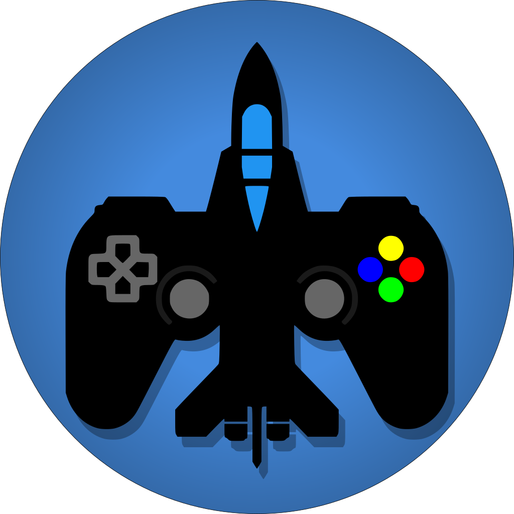

[](https://github.com/bwRavencl/ControllerBuddy/actions/workflows/release.yml)

Visit the [ControllerBuddy Homepage](https://controllerbuddy.org) to get started.  
Join the [ControllerBuddy Discord](https://discord.gg/2Sg9ggZrAp) for support and community discussions.

## 📖 Description

ControllerBuddy is an advanced gamepad mapping software that supports the creation of input profiles for complex target applications such as flight simulators.

In addition to the simple mapping of buttons and axes of a physical game controller to keyboard and mouse input, ControllerBuddy also supports feeding input commands to a virtual joystick device (vJoy/uinput).

ControllerBuddy eliminates the need for an expensive HOTAS setup to enjoy your favorite simulators. It gives you full control using just a gamepad - without even needing a keyboard or mouse.

## ⬇️ Download and Installation

### 📜 Install-Script

For the easiest way to install and update, use the [ControllerBuddy-Install-Script](https://github.com/bwRavencl/ControllerBuddy-Install-Script).  
It automates all the steps below and much more!

### 📦 Flatpak

Linux users may want to use the [ControllerBuddy-Flatpak](https://github.com/bwRavencl/ControllerBuddy-Flatpak).

### 🧑‍🔧 Manual Installation

#### 🪟 Windows x86-64

1. First download and install [vJoy 2.2.2.0](https://github.com/BrunnerInnovation/vJoy/releases/tag/v2.2.2.0) on your system.
2. [Click here](https://github.com/bwRavencl/ControllerBuddy/releases/latest) and download the latest build of ControllerBuddy for Windows as a ZIP archive.
3. Extract the `ControllerBuddy` directory from the archive to any desired location on your hard-drive.
4. Run `ControllerBuddy.exe` inside the extracted `ControllerBuddy` directory.

#### 🐧 Linux x86-64 / aarch64

1. Allow access to uinput:
    ```sh
    echo 'KERNEL=="uinput", SUBSYSTEM=="misc", TAG+="uaccess", OPTIONS+="static_node=uinput"' | sudo tee /etc/udev/rules.d/60-controllerbuddy.rules
    ```
2. Load the uinput kernel module at boot:
    ```sh
    echo uinput | sudo tee /etc/modules-load.d/controllerbuddy.conf
    ```
3. Reboot
4. [Click here](https://github.com/bwRavencl/ControllerBuddy/releases/latest) and download the latest build of ControllerBuddy for Linux as a TGZ archive.
5. Extract the `ControllerBuddy` directory from the archive to any desired location on your hard-drive.
6. Run `ControllerBuddy` inside the extracted `ControllerBuddy/bin` directory.

## ✨ Features

### 🧬 Core Capabilities

ControllerBuddy maps physical inputs to **Actions**, such as moving a virtual joystick axis, triggering a keystroke, or moving the mouse cursor.  
Mappings are organized into **Modes** - distinct functional layers activated or toggled at the press of a button.

* **Mode Switching:** Swap entire mapping layouts dynamically on the fly using toggle or momentary buttons to multiply the total number of available functions on your controller.
* **Virtual Joystick Control:** Map inputs to virtual buttons and axes, including the ability to reset axes to specific preconfigured positions.
* **Relative Axis Mapping:** Solves the challenge of mapping persistent controls to self-centering sticks. A relative axis maintains its value even after the physical stick is released - ideal for stable control over **throttle** or **camera angles**.
* **Keyboard & Mouse Emulation:** Full support for keystrokes (including modifiers), mouse buttons, cursor movement, and scrolling.
* **Action Cycles:** Sequence multiple sub-actions that trigger one after another with each press.
* **On-Screen Keyboard:** A gamepad-driven virtual keyboard that allows for the input of keystrokes and combinations without a requiring a physical keyboard.

### 👤 User Experience

* **Profile Management:** Create, save, and switch between custom mapping profiles for different games or apps.
* **Powerful UI:** A fast, clean and intuitive interface with full support for **light and dark themes**.
* **In-Game Overlay:**
    * Monitor the currently active **Mode**.
    * Visualize the current position of **virtual axes**.
* **Localization:** Fully localized in **English** and **German**.

### ⚙️ Modes of Operation

ControllerBuddy can be used as a standalone local tool or distributed over a network:

* **Local:** Standard low-latency operation on a single machine.
* **Client-Server:** Send controller inputs across a network.

### 🔌 Controller & OS Support

* **Gamepad Compatibility:**
    * **Xbox Series X|S**, **Xbox One**, and **Xbox 360 Controllers**
    * **DualSense (PS5)** and **DualShock 3/4 (PS3/PS4)** controllers
    * **Many more** via the [SDL GameControllerDB](https://github.com/mdqinc/SDL_GameControllerDB) project.
* **Operating Systems:**
    * **Windows & Linux:** Full support (Local, Client, and Server).
    * **macOS:** Server-only support (no binaries provided).

## 🗃️ Profiles

### 🧩 Definitions

**Profiles** are JSON-based configuration files that tailor ControllerBuddy to specific games.
Once loaded, they can be edited and saved through the built-in interface.

To manage complex setups, Profiles organize your input mappings into **Modes**. Think of Modes as different **layers or "shift-states"** for your controller.

Within each Mode, you can map an axis or button to one or more **Actions**.  
By assigning different Actions to the same control across multiple Modes, you enable ControllerBuddy to instantly remap your controller as you switch between layers.

> [!TIP]
> The [ControllerBuddy-Profiles](https://github.com/bwRavencl/ControllerBuddy-Profiles) repository contains a vast collection of official profiles for many different flight simulators.

### 🗺️ Structure

The general structure of a Profile looks as follows:

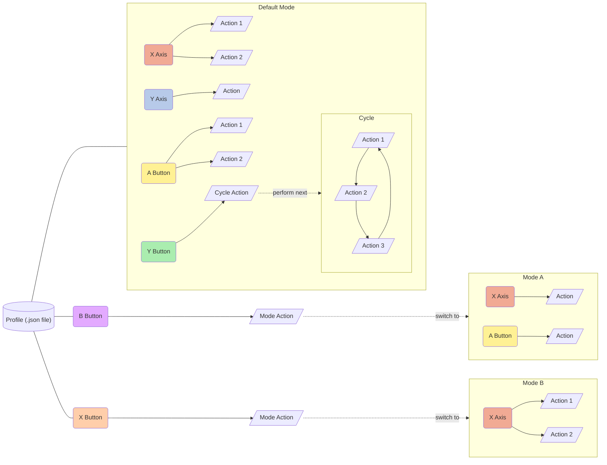
```mermaid
flowchart LR
    profile[("Profile (.json file)")] ---- defaultMode
    profile --- bButton(B Button) & xButton(X Button)
    bButton --> bButtonModeAction[/Mode Action/] -. switch to .-> modeA
    xButton --> xButtonModeAction[/Mode Action/] -. switch to .-> modeB
    subgraph defaultMode[Default Mode]
        direction LR
        defaultModeXAxis(X Axis) --> defaultModeXAxisAction1[/Action 1/] & defaultModeXAxisAction2[/Action 2/]
        defaultModeYAxis(Y Axis) --> defaultModeYAxisAction[/Action/]
        defaultModeAButton(A Button) --> defaultModeAButtonAction1[/Action 1/] & defaultModeAButtonAction2[/Action 2/]
        defaultModeYButton(Y Button) --> cycleAction[/Cycle Action/] -. perform next .-> cycleActions
        defaultModeXAxis ~~~ cycleAction
        defaultModeYAxis ~~~ cycleAction
        defaultModeAButton ~~~ cycleAction
        defaultModeYButton ~~~ cycleAction
        subgraph cycleActions[Cycle]
            cycleAction1[/Action 1/] --> cycleAction2[/Action 2/] --> cycleAction3[/Action 3/] --> cycleAction1
        end
    end
    subgraph modeA[Mode A]
        direction LR
        modeAXAxis(X Axis) --> modeAXAxisAction[/Action/]
        modeAAButton(A Button) --> modeAAButtonAction[/Action/]
    end
    subgraph modeB[Mode B]
        direction LR
        modeBXAxis(X Axis) --> modeBXAxisAction1[/Action 1/] & modeBXAxisAction2[/Action 2/]
    end
    classDef x-axis fill:#d5000055
    classDef a-button fill:#ffd60055
    classDef y-axis fill:#2962ff55
    classDef b-button fill:#aa00ff55
    classDef x-button fill:#ff6d0055
    classDef y-button fill:#00c85355
    class defaultModeXAxis,modeAXAxis,modeBXAxis x-axis
    class defaultModeAButton,modeAAButton a-button
    class defaultModeYAxis y-axis
    class bButton b-button
    class xButton x-button
    class defaultModeYButton y-button
```

### ⛓️ Mode Inheritance

When switching between Modes, **any axes or buttons not explicitly redefined will inherit their behavior from the previously active Mode**.  
This inheritance persists across multiple Mode levels, as illustrated by the following example:

**Default Mode** (Base) → **Mode A** (Layer 1) → **Mode B** (Layer 2)  
*If an axis or button is not mapped in **Mode B**, ControllerBuddy checks **Mode A**, and finally the **Default Mode**.*

### 🔀 Switching Behaviors

Two different switching behaviors can be configured:

- **Momentary (Default):** The Mode remains active only while the button is held (similar to a **Shift key**).
- **Toggle:** Press once to activate, press again to deactivate (similar to **Caps Lock**).

## 🏛️ Architecture

### 🏠 Local Mode

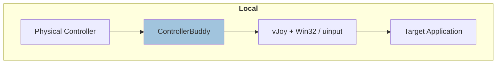
```mermaid
flowchart
    subgraph local[Local]
        physicalController[Physical Controller] --> controllerBuddy[ControllerBuddy] --> vJoy[vJoy + Win32 / uinput] --> targetApplication[Target Application]
    end
    classDef bold font-weight:bold
    classDef highlight fill:#448ade80
    class local bold
    class controllerBuddy highlight
```

### 🌐 Client-Server Mode

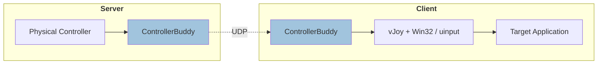
```mermaid
flowchart LR
    subgraph server[Server]
        physicalController[Physical Controller] --> controllerBuddyServer[ControllerBuddy]
    end
    controllerBuddyServer -. UDP .-> controllerBuddyClient
    subgraph client[Client]
        controllerBuddyClient[ControllerBuddy] --> vJoy[vJoy + Win32 / uinput] --> targetApplication[Target Application]
    end
    classDef bold font-weight:bold
    classDef highlight fill:#448ade80
    class server,client bold
    class controllerBuddyServer,controllerBuddyClient highlight
```

## 🖼️ Screenshots

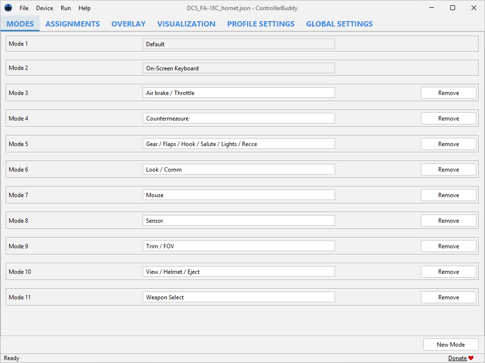  
*<small>Modes Tab</small>*

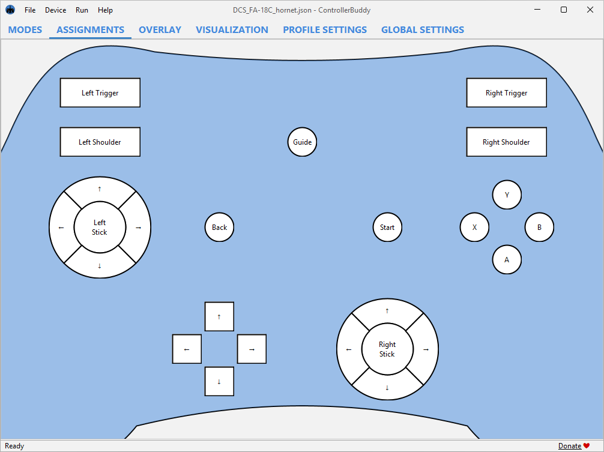  
*<small>Assignments Tab</small>*

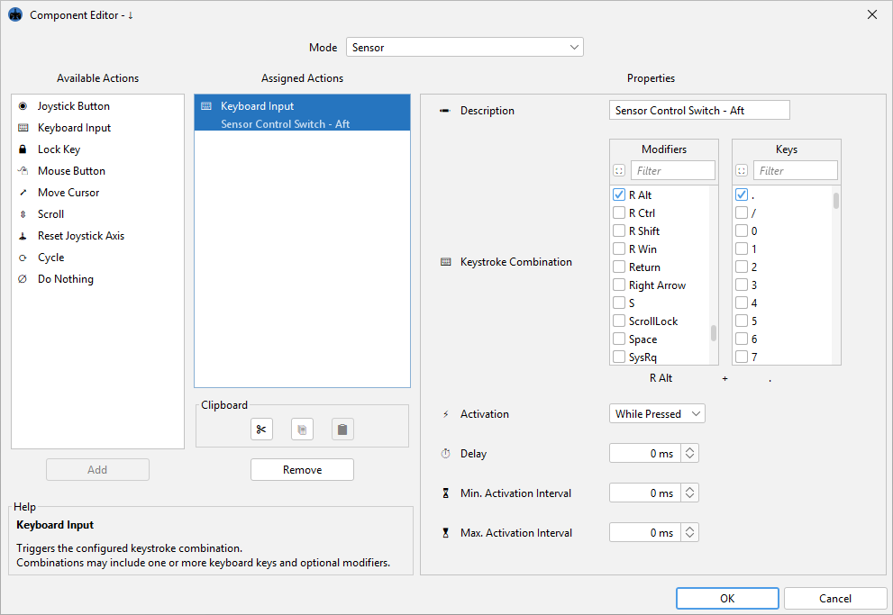  
*<small>Component Editor (Button)</small>*

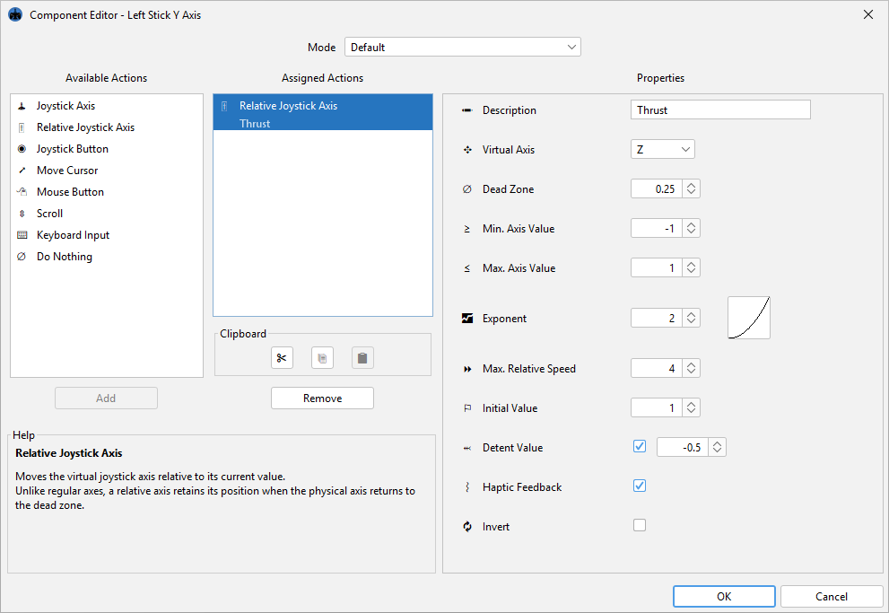  
*<small>Component Editor (Axis)</small>*

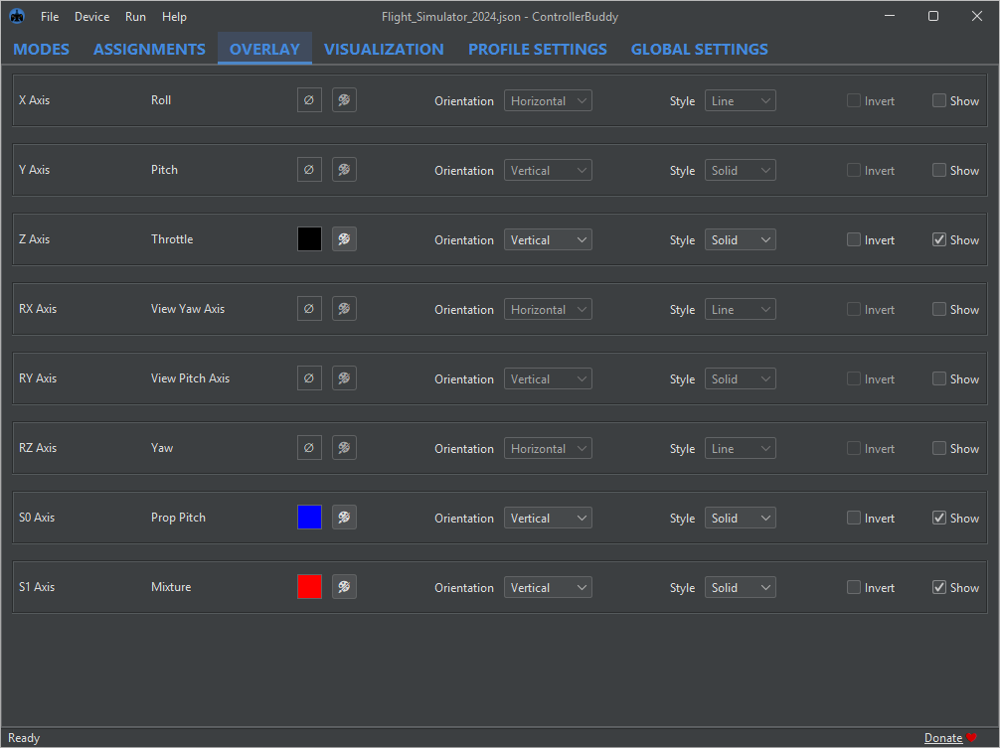  
*<small>Overlay Tab (Dark Theme)</small>*

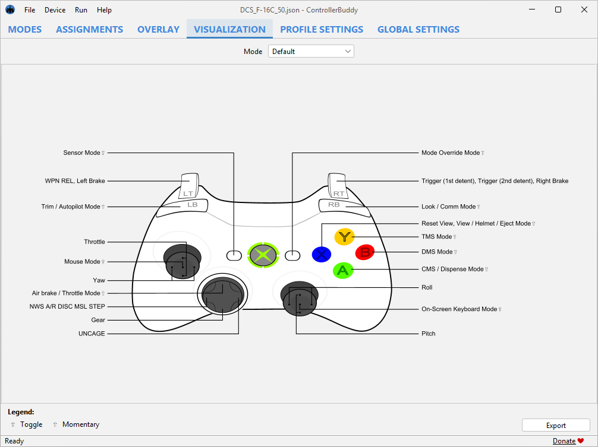  
*<small>Visualization Tab</small>*

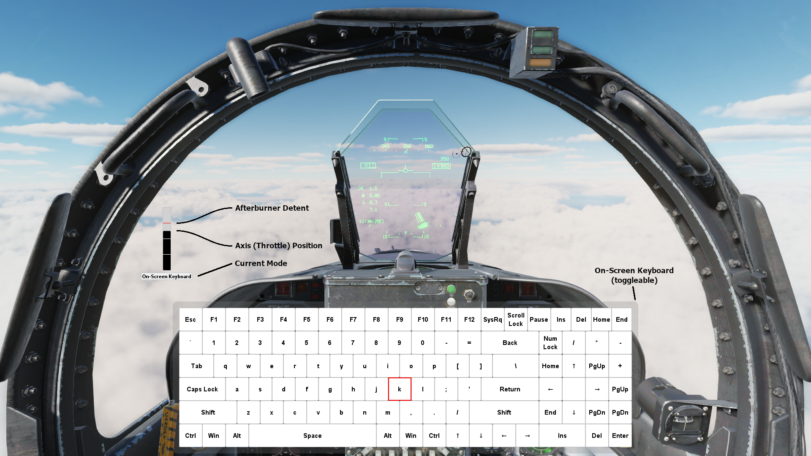  
*<small>Overlay and On-Screen Keyboard</small>*

## ⌨️ Command Line Parameters

| Parameter             | Arguments               | Description                                                                                                | Available for scripting |
|-----------------------|-------------------------|------------------------------------------------------------------------------------------------------------|:-----------------------:|
| `‑autostart`          | local / client / server | starts the specified mode of operation after launch                                                        |           yes           |
| `‑export`             | file destination        | exports a visualization of the current profile to the specified path                                       |           yes           |
| `‑gamecontrollerdb`   | file source             | adds the SDL controller mappings from the specified [file](https://github.com/mdqinc/SDL_GameControllerDB) |           yes           |
| `‑help`               |                         | prints the help and exits                                                                                  |           no            |
| `-host`               | hostname / IP address   | sets the host address for outgoing network connections                                                     |           yes           |
| `-password`           | password                | sets the password for all network connections                                                              |           yes           |
| `-port`               | port number             | sets the server port for all network connections                                                           |           yes           |
| `‑profile`            | file source             | loads the specified profile after launch                                                                   |           yes           |
| `‑quit`               |                         | quits the application                                                                                      |           yes           |
| `‑save`               | file destination        | save the current profile to the specified path                                                             |           yes           |
| `‑skipMessageDialogs` |                         | skips all message dialogs                                                                                  |           no            |
| `-timeout`            | timeout in milliseconds | sets the timeout in milliseconds for all network connections                                               |           yes           |
| `‑tray`               |                         | launches the application to the system tray                                                                |           yes           |
| `‑version`            |                         | prints the version information and exits                                                                   |           no            |

If ControllerBuddy is already running, launching a **second instance** with any of the above parameters marked as *available for scripting* **will forward the specified action to the first instance** and then exit immediately.

This powerful mechanism allows seamless integration of ControllerBuddy into third-party applications.  
For an example, see [ControllerBuddy-DCS-Integration](https://github.com/bwRavencl/ControllerBuddy-DCS-Integration), which demonstrates how ControllerBuddy can be integrated into [DCS World](https://www.digitalcombatsimulator.com).

## 🙏 Attribution

ControllerBuddy makes use of these awesome software technologies and libraries:

| Category             | Technologies                                                                                                                                                                                                                                           |
|----------------------|--------------------------------------------------------------------------------------------------------------------------------------------------------------------------------------------------------------------------------------------------------|
| **Runtime & Build**  | [Azul Zulu](https://www.azul.com), [Gradle](https://gradle.org)                                                                                                                                                                                        |
| **Input & Hardware** | [LWJGL](https://www.lwjgl.org), [SDL](https://libsdl.org), [SDL\_GameControllerDB](https://github.com/mdqinc/SDL_GameControllerDB)                                                                                                                     |
| **UI & Graphics**    | [FlatLaf](https://www.formdev.com/flatlaf), [JSVG](https://github.com/weisJ/jsvg)                                                                                                                                                                      |
| **Utilities**        | [Apache Commons CLI](https://commons.apache.org/proper/commons-cli), [ClassGraph](https://github.com/classgraph/classgraph), [dbus-java](https://hypfvieh.github.io/dbus-java), [Gson](https://github.com/google/gson), [SLF4J](https://www.slf4j.org) |
| **Code Quality**     | [CleanThat](https://github.com/solven-eu/cleanthat), [Error Prone](https://errorprone.info), [Spotbugs](https://spotbugs.github.io)                                                                                                                    |
| **Code Formatting**  | [Eclipse JDT](https://projects.eclipse.org/projects/eclipse.jdt), [Eclipse WTP](https://projects.eclipse.org/projects/webtools), [ktfmt](https://facebook.github.io/ktfmt), [Spotless](https://github.com/diffplug/spotless)                           |
| **Testing**          | [JUnit](https://junit.org), [Mockito](https://mockito.org)                                                                                                                                                                                             |

## 🛠️ Building

If you want to build ControllerBuddy from source, this section might be helpful to get you started.  
ControllerBuddy uses the Gradle build system, the following Gradle tasks are supported:

| Task                                   | Command                     |
|----------------------------------------|-----------------------------|
| Generate `Constants.java` source file  | `gradlew generateConstants` |
| Run all checks                         | `gradlew check`             |
| Apply Spotless formatting              | `gradlew spotlessApply`     |
| Run ControllerBuddy                    | `gradlew run`               |
| Run all tests                          | `gradlew test`              |
| Generate test coverage report          | `gradlew jacocoTestReport`  |
| Install a jpackage image               | `gradlew installDist`       |
| Create a ZIP-compressed jpackage image | `gradlew distZip`           |
| Create a TGZ-compressed jpackage image | `gradlew distTar`           |
| Delete build and gen directories       | `gradlew clean`             |

## ⚖️ License

[GNU General Public License v3.0](LICENSE)
