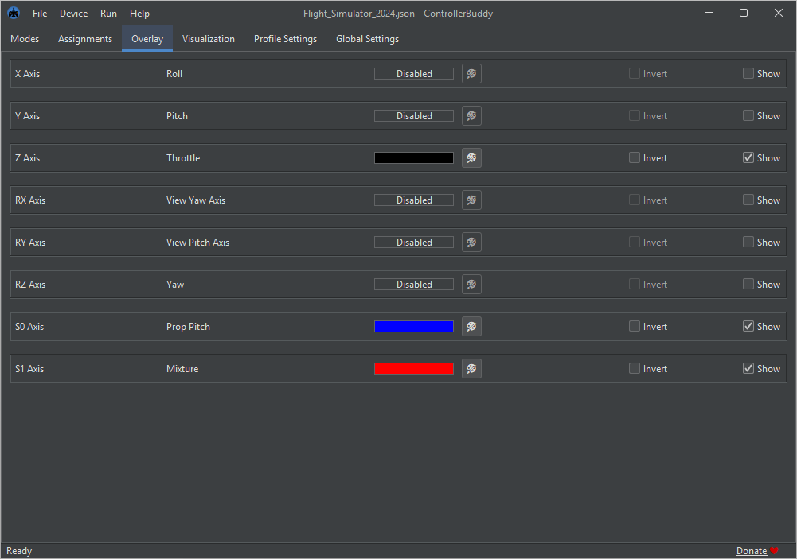
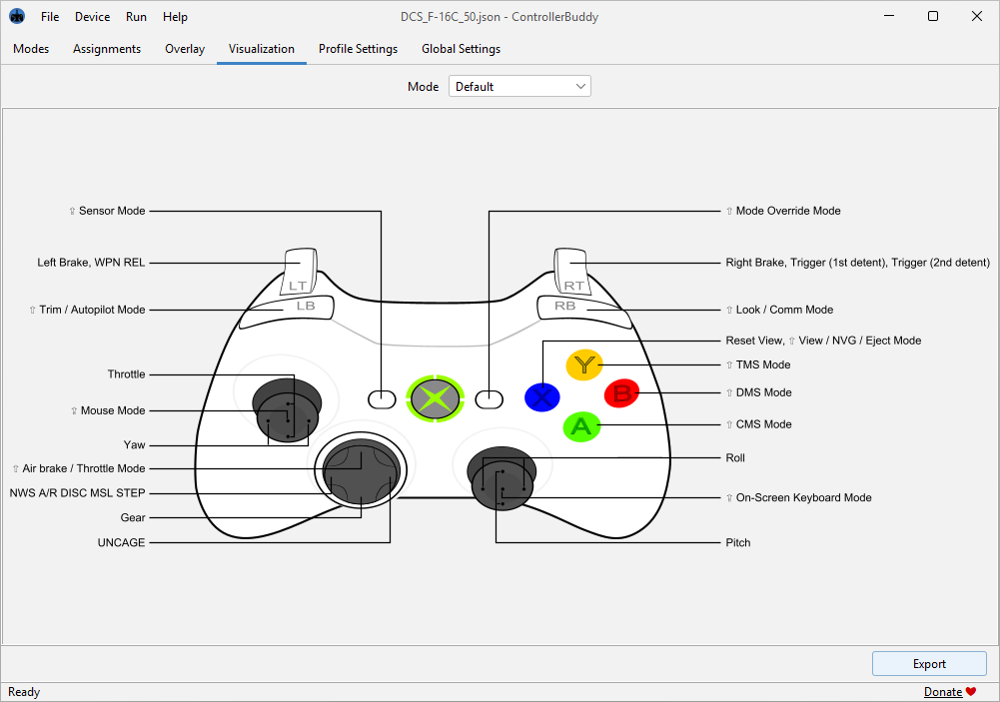

# ControllerBuddy

<!--suppress HtmlDeprecatedAttribute -->


[](https://github.com/bwRavencl/ControllerBuddy/actions/workflows/release.yml)

Visit the [ControllerBuddy Homepage](https://controllerbuddy.org) to get started.  
Join the [ControllerBuddy Discord](https://discord.gg/2Sg9ggZrAp) for support and community discussions.

## 📖 Description

ControllerBuddy is an advanced gamepad mapping software that supports the creation of input profiles for complex target applications such as flight simulators.

In addition to the simple mapping of buttons and axes of a physical game controller to keyboard and mouse input, ControllerBuddy also supports feeding input commands to a virtual joystick device (vJoy / uinput).

The goal of ControllerBuddy is to allow the user to control target applications exclusively with a gamepad without ever having to reach for a keyboard or mouse.

## ⬇️ Download and Installation

### 📜 Install-Script

For the easiest way to install and update, use the [ControllerBuddy-Install-Script](https://github.com/bwRavencl/ControllerBuddy-Install-Script).  
It automates all the steps below and much more!

### 📦 Flatpak

Linux users may want to use the [ControllerBuddy-Flatpak](https://github.com/bwRavencl/ControllerBuddy-Flatpak).

### 🧑‍🔧 Manual Installation

#### 🪟 Windows x86-64

1. First download and install [vJoy 2.2.2.0](https://github.com/BrunnerInnovation/vJoy/releases/tag/v2.2.2.0) on your system.
2. [Click here](https://github.com/bwRavencl/ControllerBuddy/releases/latest) and download the latest build of ControllerBuddy for Windows as a ZIP archive.
3. Extract the `ControllerBuddy` directory from the archive to any desired location on your hard-drive.
4. Run `ControllerBuddy.exe` inside the extracted `ControllerBuddy` directory.

#### 🐧 Linux x86-64 / aarch64

1. Create a controllerbuddy group:
    ```sh
    sudo /usr/sbin/groupadd -f controllerbuddy
    ```
2. Add yourself to the group:
    ```sh
    sudo gpasswd -a "$USER" controllerbuddy
    ```
3. Allow the group to access uinput:
    ```sh
    echo 'KERNEL=="uinput", SUBSYSTEM=="misc", MODE="0660", GROUP="controllerbuddy"' | sudo tee /etc/udev/rules.d/99-controllerbuddy.rules
    ```
4. Load the uinput kernel module at boot:
    ```sh
    echo uinput | sudo tee -a /etc/modules-load.d/uinput.conf
    ```
5. Reboot
6. [Click here](https://github.com/bwRavencl/ControllerBuddy/releases/latest) and download the latest build of ControllerBuddy for Linux as a TGZ archive.
7. Extract the `ControllerBuddy` directory from the archive to any desired location on your hard-drive.
8. Run `ControllerBuddy` inside the extracted `ControllerBuddy/bin` directory.

## ✨ Features

- Map gamepad axes and buttons to highly customizable actions:
    - vJoy axis movements (absolute and relative)
    - vJoy button presses
    - Keyboard inputs
    - Mouse inputs
    - Cycles of actions
    - Mode switching
    - etc.
- Powerful user interface:
    - Allows the creation of mapping profiles
    - Configuration of settings
    - Support for light and dark UI themes
- In-game overlay:
    - Displays current mode
    - Can show current position of virtual axes
    - On-Screen-Keyboard that can be controlled by gamepad
    - Customizable position and colors
- Two modes of operation:
    - Local
    - Client-Server (experimental! use only in trusted networks!)
- Supported gamepads:
    - Xbox 360 Controller
    - Xbox One Controller
    - Xbox Series X|S Controller
    - Dual Shock 3
    - Dual Shock 4
    - Dual Sense
    - etc. (to check if your controller is supported please refer to the [SDL_GameControllerDB](https://github.com/mdqinc/SDL_GameControllerDB) project)
- Supported operating systems:
    - Windows / Linux (local / client / server)
    - macOS (server only - no binaries provided!)
- Language support for:
    - English
    - German

## 🗃️ Profiles

Profiles are used to configure your gamepad for a specific target application.  
The general structure of a profile is as follows:

```
Profile (.json file)
├── Default Mode
│   ├── X Axis
│   │   ├── some Action
│   │   └── another Action
│   ├── Y Axis
│   │   └── some Action
│   ├── A Button
│   │   ├── some Action
│   │   └── another Action
│   ├── B Button
│   │   └── Switch Mode Action (switches to 'Another Mode' and back)
│   ├── X Button
│   │   └── Switch Mode Action (switches to 'Yet another Mode' and back)
│   └── Y Button
│       └── Cycle Action (performs 'Action 1', when pressed again 'Action 2', then 'Action 3', then starts over)
│           ├── Action 1
│           ├── Action 2
│           └── Action 3
├── Another Mode
│   ├── X Axis
│   │   └── some Action
│   └── A Button
│       └── some Action
└── Yet another Mode
    └── X Axis
        └── some Action
```

When switching from one Mode to another, all the axes and buttons that are not used by the other mode retain their function from the previous mode. This works across multiple levels of modes.

Mode switching can be configured to work in two different ways:

- Default: works like the Shift key on your keyboard
- Toggle: works like the Caps Lock key

The [ControllerBuddy-Profiles](https://github.com/bwRavencl/ControllerBuddy-Profiles) repository contains a number of well-thought-out profiles for many different flight simulators.

## 🏛️ Architecture

### 🏠 Local Mode

```
            Local:

     Physical Controller
              │
              │
              ▼
       ControllerBuddy
              |
              |
              ▼
    vJoy + Win32 / uinput
              |
              |
              ▼
      Target Application
```

### 🌐 Client-Server Mode

```
             Server:                                 Client:

       Physical Controller
                |
                |
                ▼                  UDP
         ControllerBuddy  ────────────────────►  ControllerBuddy
                                                        |
                                                        |
                                                        ▼
                                              vJoy + Win32 / uinput
                                                        |
                                                        |
                                                        ▼
                                                Target Application
```

## 🖼️ Screenshots







## ⌨️ Command Line Parameters

| Parameter           | Arguments               | Description                                                                                                | Available for scripting |
|---------------------|-------------------------|------------------------------------------------------------------------------------------------------------|:-----------------------:|
| ‑autostart          | local / client / server | starts the specified mode of operation after launch                                                        |           yes           |
| ‑export             | file destination        | exports a visualization of the current profile to the specified path                                       |           yes           |
| ‑gamecontrollerdb   | file source             | adds the SDL controller mappings from the specified [file](https://github.com/mdqinc/SDL_GameControllerDB) |           yes           |
| ‑help               |                         | prints the help and exits                                                                                  |           no            |
| -host               | hostname / IP address   | sets the host address for outgoing network connections                                                     |           yes           |
| -password           | password                | sets the password for all network connections                                                              |           yes           |
| -port               | port number             | sets the server port for all network connections                                                           |           yes           |
| ‑profile            | file source             | loads the specified profile after launch                                                                   |           yes           |
| ‑quit               |                         | quits the application                                                                                      |           yes           |
| ‑save               | file destination        | save the current profile to the specified path                                                             |           yes           |
| ‑skipMessageDialogs |                         | skips all message dialogs                                                                                  |           no            |
| -timeout            | timeout in milliseconds | sets the timeout in milliseconds for all network connections                                               |           yes           |
| ‑tray               |                         | launches the application to the system tray                                                                |           yes           |
| ‑version            |                         | prints the version information and exits                                                                   |           no            |

If ControllerBuddy is already running, launching a second instance with any of the parameters marked as "available for scripting" will forward the specified action to the first instance and then exit immediately.

This mechanism allows seamless integration of ControllerBuddy into third-party applications.  
For an example, see [ControllerBuddy-DCS-Integration](https://github.com/bwRavencl/ControllerBuddy-DCS-Integration), which demonstrates how ControllerBuddy can be integrated into [DCS World](https://www.digitalcombatsimulator.com).

## 🙏 Attribution

ControllerBuddy makes use of these awesome software technologies and libraries:

- [OpenJDK](https://openjdk.org)
- [Apache Commons CLI](https://commons.apache.org/proper/commons-cli)
- [ClassGraph](https://github.com/classgraph/classgraph)
- [dbus-java](https://hypfvieh.github.io/dbus-java/)
- [Error Prone](https://errorprone.info/)
- [FlatLaf](https://www.formdev.com/flatlaf/)
- [Gson](https://github.com/google/gson)
- [JSVG](https://github.com/weisJ/jsvg)
- [LWJGL - Lightweight Java Game Library 3](https://www.lwjgl.org)
- [SDL](https://libsdl.org)
- [SDL_GameControllerDB](https://github.com/mdqinc/SDL_GameControllerDB)
- [SLF4J](https://www.slf4j.org/)

## 🛠️ Building

If you want to build ControllerBuddy from source, this section might be helpful to get you started.  
ControllerBuddy uses the Gradle build system, the following Gradle tasks are supported:

| Task                                   | Command                 |
|----------------------------------------|-------------------------|
| Generate version source file           | gradlew generateVersion |
| Run SpotBugs and Spotless              | gradlew check           |
| Apply Spotless formatting              | gradlew spotlessApply   |
| Run ControllerBuddy                    | gradlew run             |
| Install a jpackage image               | gradlew installDist     |
| Create a ZIP-compressed jpackage image | gradlew distZip         |
| Create a TGZ-compressed jpackage image | gradlew distTar         |
| Delete build and gen directories       | gradlew clean           |

## ⚖️ License

[GNU General Public License v3.0](LICENSE)
