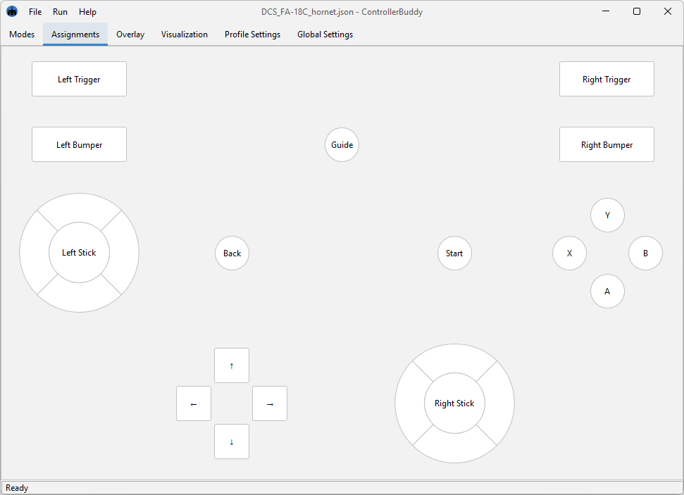

## ControllerBuddy

#### License Information:
GNU General Public License v2.0

#### Download and Installation:
1. First ensure you have correctly installed [vJoy 2.1](http://vjoystick.sourceforge.net) on your system.
2. [Click here](https://github.com/bwRavencl/ControllerBuddy/releases/latest) and download the latest build of ControllerBuddy for Windows as a ZIP archive.
3. Extract the `ControllerBuddy` directory from the archive to any desired location on your hard-drive.
4. Run `ControllerBuddy.exe` inside the extracted `ControllerBuddy` directory.

#### Description:
ControllerBuddy is a highly advanced gamepad mapping software, which supports the creation of input profiles for complex target applications such as flight simulators.  
In addition to the simplistic mapping of buttons and axes of a physical game-controller to keyboard and mouse input, ControllerBuddy also supports the feeding of input commands to a virtual joystick, provided by the awesome [vJoy](http://vjoystick.sourceforge.net) device driver created by Shaul Eizikovich.  
The goal ControllerBuddy is to allow controlling target applications without having the user take off their hands from the gamepad to reach for the keyboard or mouse.

#### Features:
- Maps gamepad axes and buttons to highly customizable actions:
  - vJoy axis movements (absolute and relative)
  - vJoy button presses
  - Keyboard inputs
  - Mouse inputs
  - Cycles of actions
  - Mode switching
  - etc.
- Powerful user interface:
  - Allows the creation of mapping profiles
  - Configuration of settings
  - Support for a light and dark UI theme
- In-game overlay:
  - Displays currently active mode
  - Can display current position of virtual axes
  - On-Screen-Keyboard that can be controlled via gamepad
  - VR support (OpenVR-based)
  - Customizable position and colors
- Two scenarios of operation:
  - Local
  - Server to client (experimental! use only in trusted networks!)
- Supported gamepads:
  - Xbox 360 Controller
  - Xbox One Controller
  - Dual Shock 3
  - Dual Shock 4 (with special support for the touchpad, haptic feedback and lightbar)
  - etc. (to check if your controller is supported please refer to the [SDL_GameControllerDB](https://github.com/gabomdq/SDL_GameControllerDB) project)
- Supported operating systems:
  - Windows x64 (local / client / server)
  - macOS (only server - no binaries provided!)
  - Linux (only server - no binaries provided!)
- Language support for:
  - English
  - German

#### Profiles:
Profiles are used to configure your gamepad for a certain target application.  
A profile has the following general structure:

- Profile (`.json` file)
  - Default Mode
    - X Axis
      - some Action
      - another Action
    - Y Axis
      - some Action
    - A Button
      - some Action
      - another Action
    - B Button
       - Mode Action (switches to "Another Mode" and back)
    - X Button
       - Mode Action (switches to "Yet another Mode" and back)
    - Y Button
       - Cycle Action (performs Action 1, when pressed again Action 2, then Action 3, then starts over)
         - Action 1
         - Action 2
         - Action 3
  - Another Mode 
    - X Axis
      - some Action
    - A Button
      - some Action
  - Yet another Mode
    - X Axis
      - some Action

When switching from one Mode to another, all the axes and buttons that are not used by the other mode retain their function from the previous mode. This works over multiple levels of modes.  
Mode switching can be configured to operate in two different ways:
- Default: works like the SHIFT key on your keyboard
- Toggle: works like the Caps Lock key

A set of well thought out profiles for the most popular flight simulators are available [here](https://github.com/bwRavencl/ControllerBuddy-Profiles).

#### Architecture:
```
              Host:                             Client:

       Physical Controller
                |
                |
                v
         ControllerBuddy  --------------->  ControllerBuddy
         |             |                    |             |
         |             |                    |             |
         v             v                    v             v
vJoy Device Driver   Win32 API     vJoy Device Driver   Win32 API
        |                |                 |                |
        |                |                 |                |
        v                v                 v                v
        Target Application                 Target Application
```

#### Example Screenshots:





#### Command Line Parameters:

| Parameter  | Arguments               | Description                                          | Available for scripting |
| ---------- | ----------------------- | ---------------------------------------------------- | :---------------------: |
| -autostart | local / client / server | starts the specified mode of operation after launch  | yes                     |
| -profile   | path of a profile-file  | loads the specified profile after launch             | yes                     |
| -tray      |                         | launches the application in the system tray          | yes                     |
| -version   |                         | prints the version information and quits             | no                      |

If an instance of ControllerBuddy is already running, launching a second instance with the parameters denoted as "available for scripting" will trigger the corresponding action in the first instance and immediately shutdown the second instance.  
This can be used to integrate ControllerBuddy into third party applications.  
For more information check out [this](https://github.com/bwRavencl/ControllerBuddy-DCS-Integration) exemplary integration of ControllerBuddy into [DCS World](https://www.digitalcombatsimulator.com).

#### Dependencies:
ControllerBuddy depends on the following awesome software technologies and libraries:
- [OpenJDK 14](https://jdk.java.net/14)
- [Apache Commons CLI](https://commons.apache.org/proper/commons-cli)
- [ClassGraph](https://github.com/classgraph/classgraph)
- [FlatLaf](https://www.formdev.com/flatlaf/)
- [Gson](https://github.com/google/gson)
- [Java Native Access (JNA)](https://github.com/java-native-access/jna)
- [LWJGL - Lightweight Java Game Library 3](https://www.lwjgl.org)
- [Pure Java HID-API](https://github.com/nyholku/purejavahidapi)

#### Building:
If you want to build ControllerBuddy from its source code this section might be helpful to get you started.  
ControllerBuddy uses the Gradle build system, the following Gradle tasks are supported:

| Task                             | Command                 |
| -------------------------------- | ----------------------- |
| Generate version source file     | gradlew generateVersion |
| Run SpotBugs and Spotless        | gradlew check           |
| Apply Spotless formatting        | gradlew spotlessApply   |
| Run ControllerBuddy              | gradlew run             |
| Install a jpackage image         | gradlew installDist     |
| Create a zipped jpackage image   | gradlew distZip         |
| Generate Eclipse files           | gradlew eclipse         |
| Delete Eclipse files             | gradlew cleanEclipse    |
| Delete build and gen directories | gradlew clean           |
